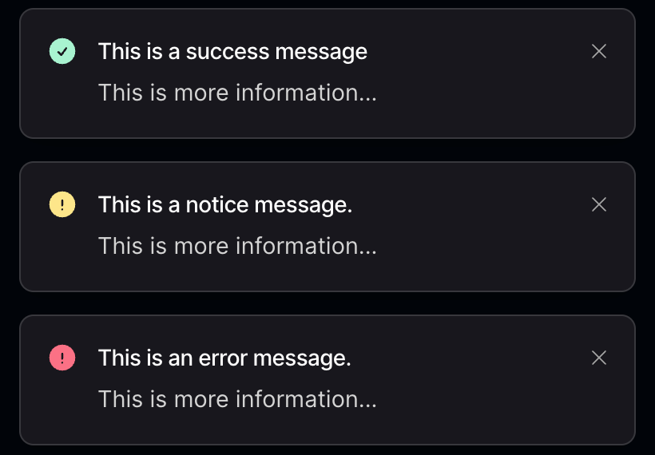

# Flash Messages

There are two types of flash messages that are available to use with RapidRails:

## FlashMessagesComponent

The [FlashMessagesComponent](https://github.com/danielpaul/RapidRails/blob/main/app/views/components/flash_messages_component.rb) is used to render a flash message at the top of the page.

Here's an example of how to use this method:

> `flash.now[:success] = "This is a success message."`

> `flash.now[:notice] = "This is a notice message."`

> `flash.now[:error] = "This is an error message."`

## FlashToastComponent

The [FlashToastComponent](https://github.com/danielpaul/RapidRails/blob/main/app/views/components/flash_toast_component.rb) is used to render flash messages as toast notifications. There is a flash_message method that can be used to create toast notifications.

This method takes four parameters:

- type: The type of the message (:success, :notice, :error).
- heading: The heading of the message.
- body: The body of the message. This is optional.
- now: A boolean that determines whether the message should be displayed immediately. This is also optional.

Here's an example of how to use this method:

> `flash_message(:success, "This is a success message", "This is more information...", now: true)`

> `flash_message(:notice, "This is a notice message", "This is more information...", now: true)`

> `flash_message(:error, "This is an error message", "This is more information...", now: true)`

