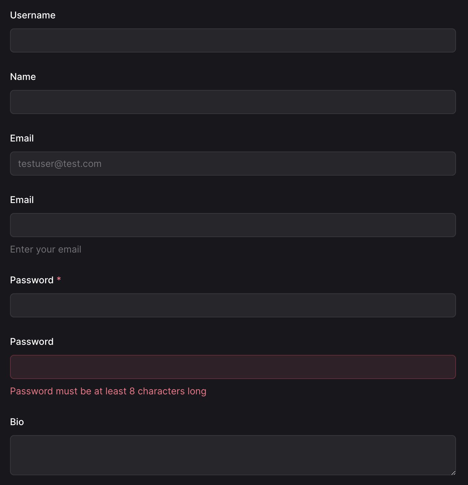

# Forms

Our [RapidRailsFormBuilder](https://github.com/danielpaul/RapidRails/blob/main/app/helpers/rapid_rails_form_builder.rb) is a custom form builder class, built on top of the default Rails form builder, that provides additional functionality and customization for form fields. If you do not want to use `RapidRailsFormBuilder`, you can always use Rails' default form builder and style it yourself.

## Usage

To use this form builder, you need to specify it when using the form_with or form_for helper in your views:

```
= form_for :something, method: :post, builder: RapidRailsFormBuilder do |form|
```

To show form errors render the `FormErrorsComponent` inside the form as follows:

```
= form_for(resource, as: resource_name, url: registration_path(resource_name), builder: RapidRailsFormBuilder
   = render FormErrorsComponent.new(resource)
```

## Fields

All the [Action View Form Helper](https://guides.rubyonrails.org/form_helpers.html#helpers-for-generating-form-elements) methods work and are styled with labels by default. Here are some examples:

### `text_field`, `email_field`, `password_field`, `text_area`

These methods create text-like fields. Here are some examples:

```
= form.text_field :username

= form.text_field :username, label: "Name"

= form.email_field :email, placeholder: "testuser@test.com"

= form.email_field :email, hint: "Enter your email"

= form.password_field :password, required: true

= form.password_field :password, error: "Password must be at least 8 characters long"

= form.text_area :bio
```



### `submit` and `button`

These methods create buttons. Here are some examples:

```
= form.button 'Cancel'

= form.button 'Cancel', disabled: true

= form.submit 'Submit'
```


### `select` and `collection_select`

These methods create select fields.

```
= form.select :number, {"one": 1, "two": 2}

= form.collection_select :posts, Post.all, :id, :title
```


### `check_box` and `radio_button`

These methods create checkbox and radio button fields. Here are some examples:

```
= form.check_box :remember_me

= form.check_box :remember_me, checked: true

= form.check_box :remember_me, disabled: true

= form.radio_button :colour, "red", label: "Red"

= form.radio_button :colour, "blue",  label: "Blue", checked: true

= form.radio_button :colour, "black", label: "Black", disabled: true
```


## Styling

There are three locations to update to customise:

- Form fields Tailwind styling are located in the [application.tailwind.css](https://github.com/danielpaul/RapidRails/blob/main/app/assets/stylesheets/application.tailwind.css) file and can be customized by editing the classes.
- The `RapidRailsFormBuilder` adds default classes to the form fields for styling. You can override these classes by specifying the `:class` option. If you would like to change the default styling for all form fields, you can do so by editing the [RapidRailsFormBuilder](https://github.com/danielpaul/RapidRails/blob/main/app/helpers/rapid_rails_form_builder.rb)
- The [FormErrorsComponent](https://github.com/danielpaul/RapidRails/blob/main/app/views/components/form_errors_component.rb) can also be edited to change the default styling for form errors.
